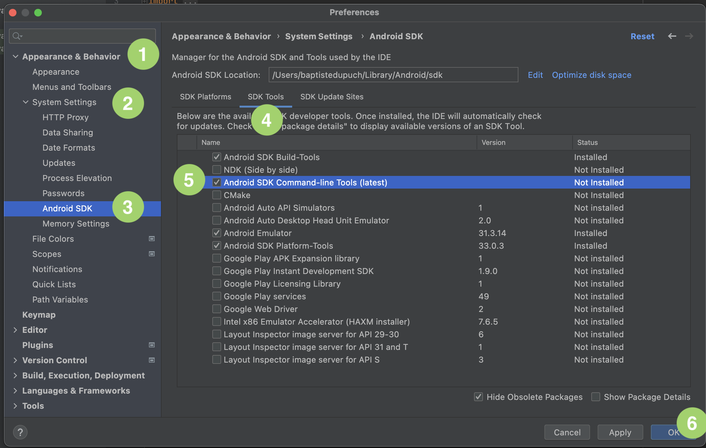
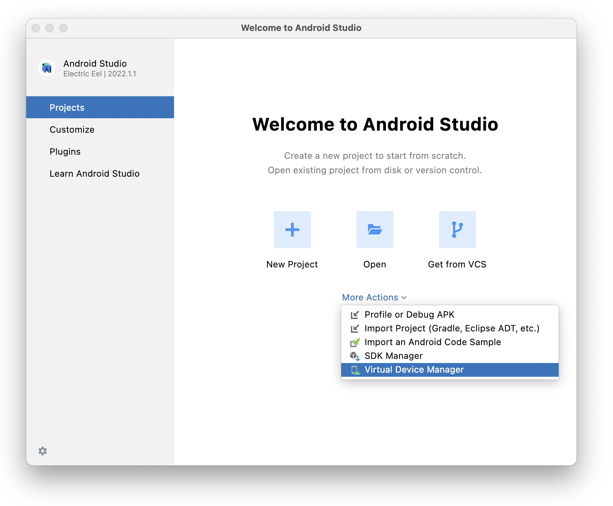
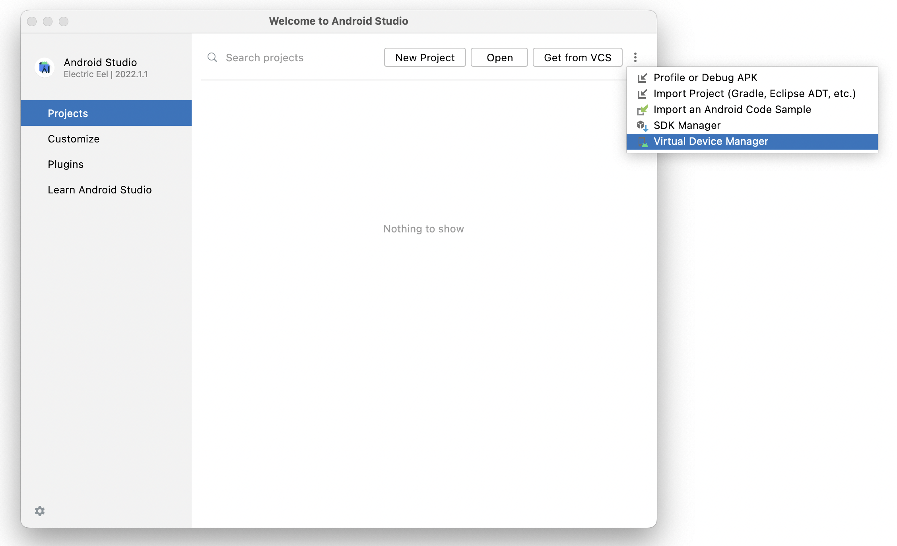
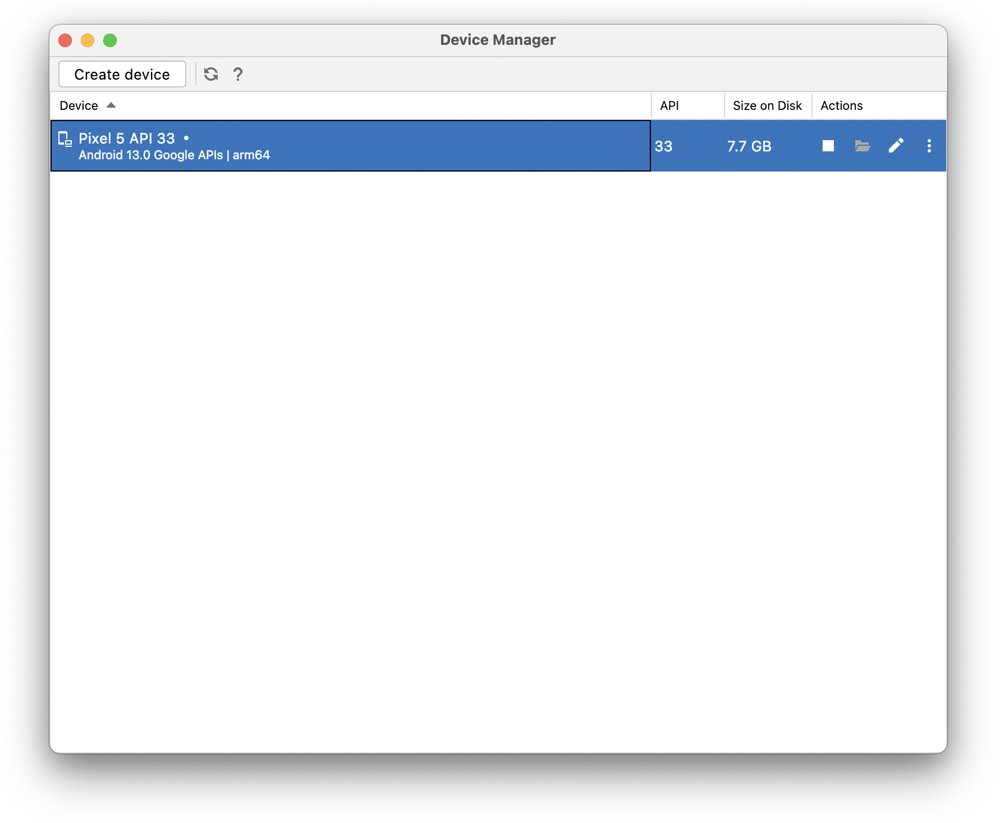
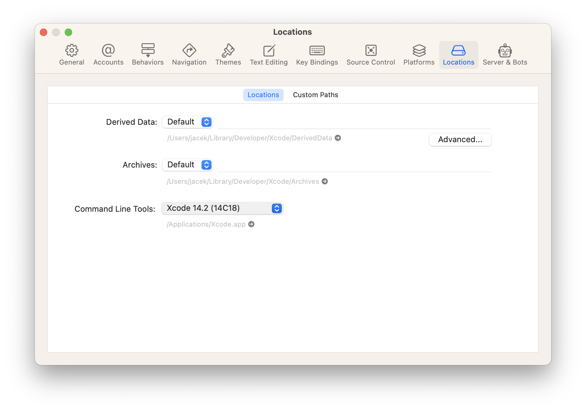
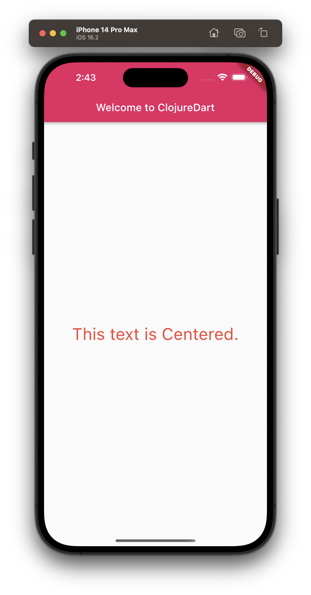

# Setup

Create your first ClojureDart Project

## Create project files

```
mkdir cljd-workshop
cd cljd-workshop
cat << EOF > deps.edn
{:paths ["src"] ; where your cljd files are
 :deps {tensegritics/clojuredart
        {:git/url "https://github.com/tensegritics/ClojureDart.git"
         :sha "3f5a65ad7ef91ad12e2e8ab20877c331a7002ff8"}}
 :aliases {:cljd {:main-opts ["-m" "cljd.build"]}}
 :cljd/opts {:kind :flutter
             :main acme.main}}
EOF
```

`acme.main` is the root namespace of the project where the main function is defined.

## Initialize 

```
clj -M:cljd init
```

## Main entry-point

```
mkdir -p src/acme
cat << EOF > src/acme/main.cljd
(ns acme.main
  (:require ["package:flutter/material.dart" :as m]))

(defn main []
  (m/runApp
    (m/MaterialApp
      .title "Welcome to Flutter"
      .theme (m/ThemeData .primarySwatch m/Colors.pink)
      .home (m/Scaffold
              .appBar (m/AppBar
                        .title (m/Text "Welcome to ClojureDart"))
              .body (m/Center
                      .child (m/Text "This text is Centered."
                               .style (m/TextStyle
                                        .color m.Colors/red
                                        .fontSize 32.0)))))))
EOF
```

## Start smulator(s)

### Apple

In another terminal window run:
```
open -a Simulator
```

### Android
You can either use Android Studio.

#### Android Studio
Download Android Studio from https://developer.android.com/studio

:bulb: There's currently a small incompatibility between the latest Studio (Eels) and Flutter: Android Studio renamed the directory containing its JRE from `jre` to `jbr`. Go to where Android Studio is installed (eg for a typical MacOS install: `/Applications/Android Studio.app/Contents/`) and do `ln -s jbr jre` (you may need to `sudo` this command).

Now run `flutter doctor`. Android Studio shoud be fully green. Good job! However you still certainly have a warning about using a command-line tool name `sdkmanager` to install other command line tools. Something like this.

```
 ✗ cmdline-tools component is missing
      Run path/to/sdkmanager --install "cmdline-tools;latest"
      See https://developer.android.com/studio/command-line for more details.
```

The trick is that the SDK manager is a GUI in Android Studio:



Once everything is downloaded, run `flutter doctor` again, it will instruct you on how to accept licenses.

Now we are almost done, we only have to create the virtual device. This is done in Android Studio Virtual Device Manager which can be found from a buried on the welcome dialogs (plural):




Once in the device manager, you pick the device and then an Android version and you'll get your virtual device listed:



Now, `flutter emulators` lists:
```
2 available emulators:

apple_ios_simulator • iOS Simulator  • Apple  • ios
Pixel_5_API_33      • Pixel 5 API 33 • Google • android`
```

And `flutter emulators --launch Pixel_5_API_33` will start the emulator (maybe asking for some OS permissions the first time)!

## Start the ClojureDart watcher

``` shell
clj -M:cljd flutter
```

### Troubleshooting

#### More than one device connected

More than one device connected; please specify a device with the '-d <deviceId>' flag, or use '-d all' to act on all devices.

```
clj -M:cljd flutter -d all
```

#### unable to find utility "xcodebuild"

ProcessException: Process exited abnormally:
xcrun: error: unable to find utility "xcodebuild", not a developer tool or in PATH
  Command: xcrun xcodebuild -list -project Runner.xcodeproj

Open XCode and go to [ Preferences > Locations > Command Line Tools ] and select or re-select Command Line Tools option.



Run again:

```
clj -M:cljd flutter -d all
```

In the end you should see the following:



You are ready to join the workshop and learn ClojureDart.